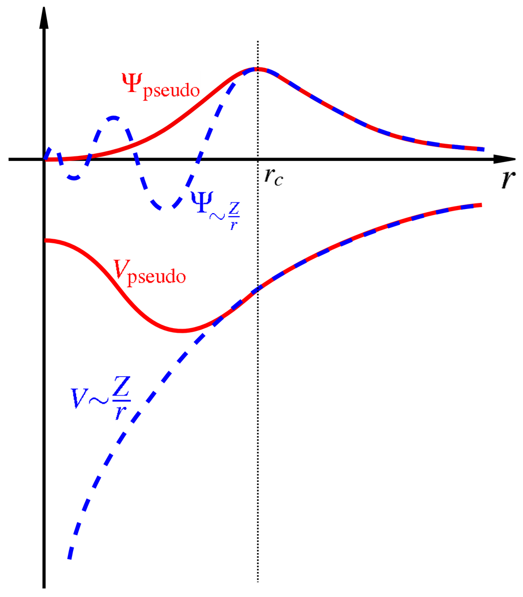

## Lecture: Introduction to Quantum ESPRESSO

### Quantum ESPRESSO: Main Features and Parameters
*An integrated suite for electronic-structure calculations and materials modeling at the nanoscale*


---

### What is Quantum ESPRESSO?
- **QE** is an integrated suite of open-source computer codes for electronic-structure calculations and materials modeling: [https://www.quantum-espresso.org/](https://www.quantum-espresso.org/)


- It is based on **Density Functional Theory (DFT)**, using a basis of **plane waves** and the **pseudopotential** method .
- The name stands for **"opEn Source Package for Research in Electronic Structure, Simulation, and Optimization"** .
- It is a major code in computational materials science, building on methodologies like Car-Parrinello molecular dynamics and Density-Functional Perturbation Theory .


###  Global Impact: A Community Standard
- **Unprecedented Citation Count:** The two main papers describing QE are among the most cited in computational physics.
    - The 2009 paper has over **27,000** citations .
    - The 2017 paper has over **7,600** citations .
    - These papers have been authored by over **25,000** unique scientists .
- **Massive User Base:** It is estimated that QE has over **40,000** users worldwide, making it the most used open-source software in its field .
- **Active Community:** The users' mailing list exchanges over **2,000** messages per year, demonstrating a vibrant and supportive community .


### The Core Methodology
- **Density-Functional Theory (DFT):** The fundamental framework for calculating the electronic ground state of a system.
- **Plane Waves (PW):** A complete and unbiased basis set used to expand the Kohn-Sham orbitals. This is ideal for periodic systems like crystals.

Kohn-sham equation:

$$\left[-\frac{\hbar^2}{2m_e}\nabla^2 + V_{\text{KS}}(\mathbf{r})\right] \psi_i(\mathbf{r}) = \epsilon_i \psi_i(\mathbf{r})$$

The wavefunctions are expanded in terms of a basis set. In quantum espresso, the basis function is plane waves. There exists other DFT codes that use localized basis function as well. Plane waves are simpler but generally requires much large number of them compared to other localized basis sets.

$$
\psi_i(\textbf{r}) = \sum_{\alpha = 1} ^{N_b} c_{i\alpha} f_{\alpha}(\textbf{r})
$$

Where $N_b$ is the size basis set. Then the eigenvalue equation becomes:

$$
\sum_{\beta} \mathcal{H}_{\alpha\beta} c_{i\beta} = \epsilon_i c_{i\alpha}
$$

$$
\Rightarrow
\begin{pmatrix}
\mathcal{H}_{11} &  ... & \mathcal{H}_{1b} \\
... & ... & ... \\
\mathcal{H}_{b1} & ... & \mathcal{H}_{bb}
\end{pmatrix}
\begin{pmatrix}
c_1 \\
... \\
c_b
\end{pmatrix}
= \epsilon_i
\begin{pmatrix}
c_1 \\
... \\
c_b
\end{pmatrix}
$$

This is a linear algebra problem, solving the above involves diagonalization of ($N_b \times N_b$) matrix which gives us corresponding eigenvalue and eigenfunction.

- **Pseudopotentials:** These replace the strong ionic potential and core electrons with a weaker effective potential acting on the valence electrons. This significantly reduces the computational cost and the size of the plane-wave basis set required . QE supports:
    - Norm-conserving pseudopotentials
    - Ultrasoft (US) pseudopotentials (Vanderbilt type)
    - Projector Augmented Wave (PAW) method 

Libraries: [Standard solid-state pseudopotentials SSSP](https://legacy.materialscloud.org/discover/sssp/table/efficiency), https://www.pseudo-dojo.org/, etc.




In the Kohn-Sham equations, electrons with higher angular momentum ($l>0$) are kept away from the nucleus by a centrifugal barrier ($\propto l(l+1)/2r^2$). Near the nucleus, this barrier is much larger than the nuclear potential, forcing their wavefunctions to vanish ($\propto r^l$). Only $l=0$ (s-electrons) can have a nonzero value at the nucleus.

The all-electron wavefunction oscillates rapidly near the nucleus because the real nuclear potential is singular (very deep). To eliminate these costly oscillations in a plane-wave basis, we construct a pseudopotential that is smooth and has no singularity. This is achieved by designing a smooth pseudo-wavefunction first (which has no nodes and matches the true wavefunction outside a cutoff radius $r_c$), and then inverting the Schrödinger equation to find the potential that produces it. The resulting potential often has a characteristic "bump" that prevents the wavefunction from oscillating.

Here is a concise explanation of why calculations are performed in reciprocal space rather than real space in Quantum ESPRESSO, formatted for your lecture.

This is an excellent and fundamental question. The short answer is that we work in reciprocal space because it transforms the difficult problem of electron interactions into a much simpler, almost "local" problem.

Here’s a detailed breakdown of why we do this, starting from the physical problem and moving to the practical benefits.

### Periodic systems and Bloch's Theorem

The periodicity of \(V_{\text{eff}}(\mathbf{r})\) is the golden key. **Bloch's Theorem** states that for a periodic potential, the solutions \( \psi_i(\mathbf{r}) \) (the wavefunctions) can be written as a plane wave modulated by a function with the same periodicity as the lattice:

\[ \psi_{n\mathbf{k}}(\mathbf{r}) = e^{i\mathbf{k} \cdot \mathbf{r}} u_{n\mathbf{k}}(\mathbf{r}) \]

where:
- \(u_{n\mathbf{k}}(\mathbf{r})\) has the periodicity of the lattice ( \(u_{n\mathbf{k}}(\mathbf{r}) = u_{n\mathbf{k}}(\mathbf{r} + \mathbf{R})\) for any lattice vector \(\mathbf{R}\)).
- \(e^{i\mathbf{k} \cdot \mathbf{r}}\) is a plane wave.
- \(\mathbf{k}\) is the wavevector (a point in reciprocal space).
- \(n\) is the band index.

This theorem has a profound consequence: **instead of solving for wavefunctions over the entire, infinite solid**, we only need to solve for the wavefunctions within a single **unit cell**, but we must do this for every possible wavevector \(\mathbf{k}\).

### Why to work in the reciprocal space?

Working in reciprocal space (the space of \(\mathbf{k}\)-vectors) is the most natural way to leverage Bloch's Theorem.

- **Problem:** We need to find an infinite number of wavefunctions for an infinite number of electrons in an infinite solid.
- **Bloch's Theorem Solution:** The theorem tells us that the wavefunctions are labeled by two quantum numbers: \(n\) and \(\mathbf{k}\).
    - The band index \(n\) is discrete. Because the electrons are fermions, they fill up these bands.
    - The wavevector \(\mathbf{k}\) is continuous, but states with \(\mathbf{k}\) and \(\mathbf{k} + \mathbf{G}\) (where \(\mathbf{G}\) is a **reciprocal lattice vector**) are physically equivalent. This means all unique \(\mathbf{k}\) values are contained within the first **Brillouin zone** (the primitive cell of the reciprocal lattice).

So, the infinite problem is now a **finite problem**: solve the Kohn-Sham equations for the discrete set of bands \(n\) at a finite set of \(\mathbf{k}\)-points within the first Brillouin zone. The total energy and electron density are then calculated by integrating (or summing) over these \(\mathbf{k}\)-points.

### Basis: Plan waves

The choice of reciprocal space also provides the most convenient mathematical tools: **plane waves**. Because the functions \(u_{n\mathbf{k}}(\mathbf{r})\) are periodic, they can be expanded using a Fourier series:

\[ u_{n\mathbf{k}}(\mathbf{r}) = \sum_{\mathbf{G}} c_{n\mathbf{k}}(\mathbf{G}) e^{i\mathbf{G} \cdot \mathbf{r}} \]

Plugging this back into the Bloch wavefunction, we get:

\[ \psi_{n\mathbf{k}}(\mathbf{r}) = \sum_{\mathbf{G}} c_{n\mathbf{k}}(\mathbf{G}) e^{i(\mathbf{k} + \mathbf{G}) \cdot \mathbf{r}} \]

This is a **plane wave basis set**.
- The basis functions are \(e^{i(\mathbf{k} + \mathbf{G}) \cdot \mathbf{r}}\).
- The coefficients to solve for are \(c_{n\mathbf{k}}(\mathbf{G})\).

Why are plane waves so great?
1.  **Completeness:** They form a complete, orthonormal basis.
2.  **Simplicity:**  Plane Waves are Diagonal in Reciprocal Space
The kinetic energy operator in the Kohn-Sham equations is much simpler in reciprocal space. While it involves a second derivative in real space ($-\frac{\hbar^2}{2m}\nabla^2$), in reciprocal space it becomes a simple multiplication:
$$
-\frac{\hbar^2}{2m}\nabla^2 e^{i\mathbf{G}\cdot\mathbf{r}} = +\frac{\hbar^2}{2m}|\mathbf{G}|^2 e^{i\mathbf{G}\cdot\mathbf{r}}
$$
This turns a difficult differential equation into a manageable linear algebra problem.

3.  **Convergence:** We can control the accuracy of the calculation by simply truncating the sum at a maximum kinetic energy (\(E_{\text{cut}} = \frac{\hbar^2 |\mathbf{k}+\mathbf{G}|^2}{2m}\)), which corresponds to a maximum \(|\mathbf{G}|\). There's no "basis set superposition error" as seen with atomic orbital bases.
4.  **Fast Fourier Transforms (FFTs):** This is the computational masterstroke. We can use FFTs to quickly move between:
    - **Reciprocal Space:** Where the kinetic energy operator is perfectly diagonal (\(-\nabla^2 \rightarrow |\mathbf{k}+\mathbf{G}|^2\)) and the Hamiltonian is easy to set up.
    - **Real Space:** Where the potential \(V_{\text{eff}}(\mathbf{r})\) is simply multiplicative ( \(V_{\text{eff}}(\mathbf{r})\psi(\mathbf{r})\) ).

The entire DFT self-consistency loop is built around shuttling data between real and reciprocal space using FFTs, exploiting the fact that each term of the Hamiltonian is easiest to compute in one of the two representations.


### Main Features: Ground-State & Structure
Quantum ESPRESSO is modular. The core components handle a wide variety of calculations.

- **Ground-State Calculations (PWscf module):**
    - Self-consistent total energies, forces, stresses, and Kohn-Sham orbitals .
    - Supports collinear and noncollinear magnetism, including spin-orbit coupling .
    - Berry phase calculations for polarization .
- **Structure Optimization & Dynamics:**
    - **Structural optimization** (BFGS, Broyden–Fletcher–Goldfarb–Shanno algorithm. It is a quasi-Newton method used for structural optimization) to find stable atomic configurations .
    - **Born-Oppenheimer Molecular Dynamics (BOMD)** and **Car-Parrinello Molecular Dynamics (CPMD)** .
    - **Nudged Elastic Band (NEB)** method for finding reaction pathways and transition states .

### Main Features: Advanced Functionals & Methods
QE goes beyond standard DFT approximations.

- **Exchange-Correlation Functionals:** A vast library from LDA and GGA (PBE, PW91) to meta-GGA, hybrid functionals (PBE0, B3LYP, HSE), and exact exchange (HF) .
- **Van der Waals Corrections:** Includes Grimme's DFT-D2/D3, Tkatchenko-Scheffler, and non-local vdW-DF functionals .
- **Strongly Correlated Systems:** Implements DFT+U and DFT+U+V (Hubbard corrections) .
- **Electrochemistry:** Specialized boundary conditions like the Effective Screening Medium (ESM) method for surfaces and interfaces in solution .

### Main Features: Response Properties & Spectroscopies
A key strength of QE is its ability to calculate response properties using **Density-Functional Perturbation Theory (DFPT)** .

- **Vibrational Properties (PHonon module):**
    - Phonon frequencies and eigenvectors at any wavevector .
    - Full phonon dispersions and interatomic force constants.
    - Infrared and Raman cross-sections .
- **Electron-Phonon Coupling (EPW module):** Calculates electron-phonon coefficients and related properties (e.g., superconductivity) .
- **Spectroscopic Properties:**
    - **TDDFPT** (TurboTDDFT) for optical absorption and Electron Energy Loss Spectroscopy (EELS) .
    - **X-ray Absorption Spectra (Xspectra module)** .
    - **NMR chemical shifts (GIPAW)** .

---

###  Key Input Parameters: The Control Block
The input for the main `pw.x` executable is organized into namelists. Let's look at the most important ones.

- **&CONTROL:** Directs the type of calculation and output.
    - `calculation = 'scf'` : Self-consistent field (ground state energy).
    - `calculation = 'relax'` : Structural optimization (ion relaxation).
    - `calculation = 'vc-relax'` : Variable-cell relaxation (optimize cell shape/volume).
    - `calculation = 'nscf'` : Non-self-consistent (for bands, DOS).
    - `restart_mode`: Controls whether to start fresh (`'from_scratch'`) or restart (`'restart'`) .
    - `pseudo_dir`: Directory containing the pseudopotential files .
    - `outdir` / `wfcdir`: Directories for temporary and wavefunction files .

###  Key Input Parameters: The System & Electrons Blocks
- **&SYSTEM:** Defines the physical system and computational parameters.
    - `ibrav`: Bravais lattice index (e.g., `ibrav=1` for cubic, `ibrav=0` for no symmetry) .
    - `celldm(i)`: Crystalline lattice constants (in Bohr or Alat) .
    - `nat` / `ntyp`: Number of atoms and number of types of atoms .
    - **`ecutwfc`**: The most critical parameter! The kinetic energy cutoff (in Ry) for the plane-wave basis set. **Must be converged** .
    - `ecutrho`: Cutoff for the charge density and potential (usually 4-12 times `ecutwfc`) .
    - `occupations`: How to occupy states (`'smearing'` for metals, `'fixed'` for insulators) .
    - `tot_charge`: Total charge of the system .

- **&ELECTRONS:** Controls the SCF convergence.
    - `conv_thr`: Convergence threshold for the SCF energy (in Ry). A typical value might be `1.0d-8` to `1.0d-10` for tight convergence .
    - `mixing_beta`: Mixing factor for charge density in the SCF cycle (default 0.7). Lower values can help difficult cases converge .


###  Key Input Parameters: I/O & K-Points
- **ATOMIC_SPECIES:** Links each atomic type to a pseudopotential file and its atomic mass .
    ```
    ATOMIC_SPECIES
    Sr  87.62  Sr.pbe.UPF
    ```
- **ATOMIC_POSITIONS:** Lists the coordinates of each atom, using the specified format (`crystal`, `angstrom`, `bohr`) .
- **K_POINTS:** Defines the sampling of the Brillouin zone.
    - `automatic` : Generates a Monkhorst-Pack grid (e.g., `K_POINTS automatic 6 6 6 1 1 1`) .
    - `gamma` : Uses the faster Gamma-point only routines .
    - A higher k-point density is required for metals and insulators with small band gaps. **Must be converged**.

---

###  Parallelism and Performance
QE is designed for high-performance computing (HPC) and scales well on parallel architectures .

- **Hybrid Parallelization:** Employs a mixed MPI and OpenMP paradigm .
- **Multiple Parallelization Levels:**
    - **Pool parallelism (`-npool`):** Distributes **k-points** among MPI groups. This is the most efficient first step .
    - **Band / Linear Algebra:** Distributes the calculation over **bands**.
    - **Plane-Wave / FFT:** Distributes the 3D FFT grid over processors (requires careful tuning) .
- **GPU Acceleration:** Recent versions support offloading computations to NVIDIA and AMD GPUs for significantly faster calculations .
- **Command-line Options:** Parallelism is controlled at runtime when you launch the executable, e.g.:
    `mpirun -np 128 pw.x -npool 8 -in input.in > output.out`

###  Summary & Resources
- **Quantum ESPRESSO** is a powerful, versatile, and community-driven open-source software package for quantum materials modeling.
- Its core strength lies in its comprehensive implementation of DFT, DFPT, and many advanced methodologies .
- A successful calculation requires careful selection of **pseudopotentials**, and convergence testing of key parameters like **`ecutwfc`** and the **k-point grid**.
- Its efficient parallelization allows it to run on systems ranging from workstations to the largest supercomputers .

- **Resources:**
    - Official Website: [www.quantum-espresso.org](https://www.quantum-espresso.org/) 
    - Key Papers: Giannozzi et al. (2009, 2017) 
    - Documentation & Tutorials: Available on the official site and in the code repository.
