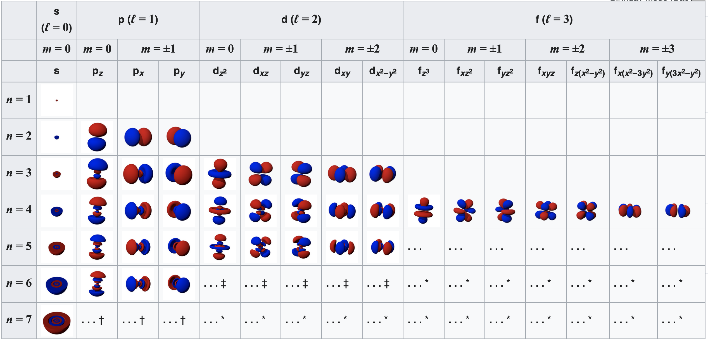
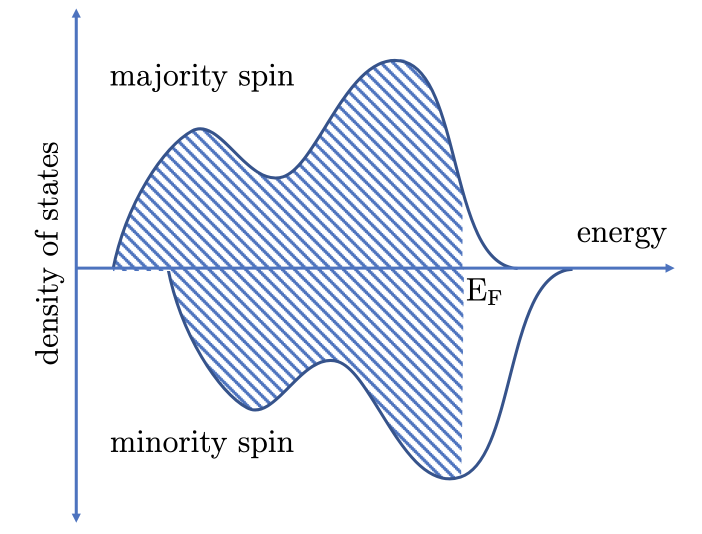

# Lecture: The Origin of Magnetism - From Electronic Structure to Exchange Interactions

## Introduction

We're all familiar with magnets – they're on our refrigerators, in our speakers, and inside every hard drive. But if you take a bar magnet and cut it in half, you don't get one north pole and one south pole. You get two smaller, complete magnets. Cut those in half again, and you get even more magnets. This hints that the source of magnetism is not some macroscopic property, but is fundamental to the very atoms that make up the material.

Here, we're going to dive deep into the atomic and electronic world to answer a seemingly simple question: **why are some materials magnetic?**

## Electrons as Tiny Magnets

The story begins not with the atom as a whole, but with its electrons. For a long time, we understood that electric currents could create magnetic fields, as described by Ampère. But what creates a magnetic field in a permanent magnet, where there's no obvious battery or current?

The answer lies in the inherent properties of the electron itself. When a magnetic moment $\mathbf{m}$ is placed in an external magnetic field $\mathbf{B}$, it experiences a torque that tends to align it with the field:

$$\pmb{\tau} = \mathbf{m} \times \mathbf{B}$$

This torque is fundamental to understanding how magnetic moments respond to applied fields. The collective behavior of many such moments leads to the macroscopic property of **magnetization** $\mathbf{M}(\mathbf{r})$, defined as the volumetric density of magnetic moments:

$$\mathbf{M}(\mathbf{r}) = \frac{\mathrm{d}\mathbf{m}}{\mathrm{d}V}$$

There are two contributions to an electron's magnetic moment:

1.  **Orbital Angular Momentum:** You can think of an electron orbiting the nucleus as a tiny loop of electric current. This circulating charge creates a magnetic field, just like a microscopic electromagnet. The orbital magnetic moment is related to the orbital angular momentum $\mathbf L = \mathbf r_j \times (m_e \mathbf v_j)$ by:

    $$\mathbf{m}^{\mathrm{orb}} = -\frac{\mu_{\mathrm{B}}}{\hbar} \mathbf{L}$$

    where the minus sign reflects the negative charge of the electron.

2.  **Electron Spin:** This is a purely quantum-mechanical property with no classical analog. The electron behaves as if it is spinning on its own axis, and this intrinsic "spin" $\mathbf{S}$ gives it an additional magnetic moment:

    $$\mathbf{m}^{\mathrm{spin}} = \frac{\mu_{\mathrm{B}}}{\hbar} g_e \mathbf{S}$$

In both expressions, we encounter the **Bohr magneton** $\mu_{\mathrm{B}} = e\hbar/2m_e$, the fundamental quantum of magnetic moment for an electron. The quantity $g_e$ is the **Landé g-factor**, which for a free electron is approximately:

$$g_e = 2\left(1 + \frac{\alpha}{2\pi} + \mathcal{O}(\alpha^{2})\right) \approx 2.0023$$

where $\alpha = 1/137$ is the fine-structure constant. For most practical applications, we can take $g_e = 2$.

In an atom, these orbital and spin angular momenta combine to give the total magnetic moment:

$$\mathbf{m} = \frac{\mu_B}{\hbar} \sum_j(\mathbf{L}_j + 2\mathbf{S}_j)$$

In atoms with completely filled electron shells, the total angular momentum cancels out to zero. **For every electron spinning up, there's one spinning down, and for every orbital motion in one direction, there's one in the opposite direction.** These atoms have no permanent magnetic dipole moment and are called **diamagnetic**.

Magnetism requires **unpaired electrons**. In atoms with partially filled shells, like the transition metals iron, cobalt, and nickel, there are unpaired electrons. Their spin and orbital moments don't cancel, giving the atom a net magnetic moment.

## Isolated atom

The magnetic moment of an atom originates from the orbital and spin angular momenta of its electrons. In a hydrogen atom, each electron state is characterized by four quantum numbers:

- **Principal quantum number $n$**: Associated with the number of radial nodes in the wavefunction
- **Orbital angular momentum quantum number $l$** (azimuthal): Satisfies $\langle L^2 \rangle = \hbar^2 l(l+1)$, where $0 \leq l \leq n-1$
- **Magnetic quantum number $m_l$**: Eigenvalue of the $z$-component of orbital angular momentum, $\langle L^z \rangle = \hbar m_l$, with $-l \leq m_l \leq l$
- **Spin quantum number $m_s$**: Associated with the $z$-component of spin angular momentum, $\langle S^z \rangle = \hbar m_s$, where $m_s = \pm 1/2$

States with the same $n$ form a **shell**. Within each shell, states with the same $l$ form a **subshell** (labeled $s, p, d, f$ for $l = 0,1,2,3$). Each orbital (specific $m_l$) has two channels for the two possible $m_s$ values.

### Ground State Determination and Hund's Rules

For an isolated atom in its ground state, electrons fill orbitals according to:

1. **Pauli's exclusion principle**: No two electrons can share the same set of quantum numbers
2. **Energy ordering**: Orbitals with lowest energy (depending on $n$ and $l$) are filled first
3. **Hund's rules** (priority within each subshell):
   - **First rule**: Electrons occupy orbitals to maximize total spin $S$. Each orbital in a subshell gets one electron with parallel spins before doubling occupancy. This minimizes Coulomb repulsion.
   - **Second rule**: For a given $S$, maximize total orbital angular momentum $L$. Spin-spin and orbital-orbital interactions are both ferromagnetic, with spin-spin being stronger.
   - **Third rule**: Total angular momentum $J$ is given by $J = |L - S|$ if the subshell is less than half-full, or $J = L + S$ if more than half-full. For half-full subshells, $L = 0$ so $J = S$. These differences arise from spin-orbit coupling.

- **Important consequence**: Full subshells have no net angular momentum—for every electron with $m_s$, there's one with $-m_s$, and similarly for $m_l$. This explains why noble gases are non-magnetic.

- **Most elements have net magnetic moments when isolated**: Since most atoms have incomplete subshells, they possess net angular momentum and therefore magnetic moments

## In solids: localized magnetism

Elements that retain their magnetic moments in solids typically have magnetic moments from inner incomplete subshells (like $3d$, $4f$ electrons). These electrons are:

- Less involved in chemical bonding
- Well-localized at their crystal sites

However, observed magnetic moments in solids often differ from isolated atoms. **Notably, orbital angular momentum $L$ is often quenched** due to the nonspherical electrostatic potential from surrounding atoms in the crystal.

- **Localized magnetism in solids**: Elements with magnetic moments from inner incomplete subshells can retain their magnetism in solids because these electrons are less involved in bonding

The magnetic electrons remain well-localized at their crystal sites, typical of **insulators**

Here is a summary of the provided text, restructured into clear, bulleted points for clarity and study.

## Itinerant Magnetism and the Hubbard Model

- **Concept of Itinerant Magnetism:** In materials like Fe, Co, and Ni, the same electrons that conduct electricity are also responsible for the magnetic properties. Magnetism here is not from localized electrons but from the mobile conduction electrons themselves.

- **Role of Coulomb Interaction:** The Coulomb interaction between electrons causes the energy bands for spin-up and spin-down electrons to shift relative to each other below a critical temperature (e.g., the Curie temperature). This makes one spin orientation more favorable, creating an imbalance in the number of electrons in each spin channel, which results in a net magnetization.

- **The Hubbard Model:** This is a simple yet powerful model used to describe this phenomenon. Its Hamiltonian is:
    $$H = \sum_{ij\sigma} t_{ij} c_{i\sigma}^\dagger c_{j\sigma} + \frac{1}{2}U \sum_{i\sigma} n_{i\sigma} n_{i\bar{\sigma}}$$
    - **Creation/Annihilation Operators:** $c_{i\sigma}^\dagger$ creates, and $c_{j\sigma}$ destroys, an electron of spin $\sigma$ on crystal site $i$ or $j$.
    - **Hopping Integral ($t_{ij}$):** This parameter encompasses the electron's kinetic energy and the crystal potential. It is associated with the probability of an electron hopping from site $i$ to site $j$.
    - **On-site Coulomb Interaction ($U$):** This parameter represents the screened effective Coulomb potential that electrons feel only when they occupy the same atomic site. This is a good approximation for metals, where the Coulomb interaction is heavily screened.

- **Mean-Field Solution and the Stoner Criterion:** The Hubbard model can be solved approximately using a mean-field (Hartree-Fock) approach. This involves replacing four-operator terms with products of operator pairs and their average values. This solution shows that the non-magnetic (paramagnetic) state becomes unstable when the **Stoner criterion** is met:
    $$U \cdot \rho(E_F) \ge 1$$
    where $\rho(E_F)$ is the density of states at the Fermi level ($E_F$). If this criterion is satisfied, the system will spontaneously order magnetically.

- To become magnetic, a material must pay an energy "cost" (moving electrons into higher energy states). A high density of states makes this cost cheap.

- However, aligning spins creates an energy "gain" (the exchange interaction, **U**). If the gain (**U**) is bigger than the cost, magnetism wins.

- **Exchange Splitting:** When magnetic order occurs, the densities of states for majority and minority spins are shifted apart in energy by an amount $\Delta$, known as the exchange splitting. This shift is proportional to the magnetization:
    $$\Delta = U m$$
    where $m = n_\uparrow - n_\downarrow$ is the net magnetization (the imbalance in the number of up and down spin electrons).

- **Local Moments from Itinerant Electrons:** The imbalance of spin-up and spin-down electrons on a crystal site yields a net local magnetic moment ($m_i$). It is crucial to understand that these "local moments" are generated by **itinerant electrons** that are not permanently fixed to any particular atomic site.

## Exchange Interaction

The exchange interaction is the fundamental quantum mechanical mechanism responsible for magnetic order in materials. Unlike classical forces, it has no direct analog in classical physics and arises purely from the combination of the Pauli exclusion principle and the Coulomb interaction between electrons .

### 1. Physical Origin: Spin-Dependent Coulomb Interaction

At its core, the exchange interaction describes how the Coulomb repulsion between electrons depends on the relative orientation of their spins . This spin dependence emerges from a fundamental constraint: electrons are indistinguishable fermions, and their total wavefunction must be antisymmetric under particle exchange.

When two electrons occupy overlapping orbitals, their spatial wavefunction symmetry is strictly coupled to their spin state:

- **Spin singlet (S = 0, antiparallel spins)** → Spatially symmetric wavefunction → Electrons can approach each other closely → Higher Coulomb repulsion energy
- **Spin triplet (S = 1, parallel spins)** → Spatially antisymmetric wavefunction → Electrons are kept apart by the Pauli principle → Lower Coulomb repulsion energy 

**Singlet state** (S = 0, antisymmetric):

$ |0,0\rangle = \frac{1}{\sqrt{2}}\left( |\!\uparrow\downarrow\rangle - |\!\downarrow\uparrow\rangle \right) $ 

**Triplet states** (S = 1, symmetric):

$ |1,1\rangle = |\!\uparrow\uparrow\rangle $

$ |1,0\rangle = \frac{1}{\sqrt{2}}\left( |\!\uparrow\downarrow\rangle + |\!\downarrow\uparrow\rangle \right) $ 

$ |1,-1\rangle = |\!\downarrow\downarrow\rangle $ 

This difference in Coulomb energy between parallel and antiparallel spin configurations is the **exchange energy**. The effect is purely electrostatic in origin—electrons do not directly "sense" each other's spins; rather, the spin configuration determines how they distribute in space to minimize repulsion .

### 2. Mathematical Derivation: The Two-Electron System

The exchange interaction is most clearly demonstrated using the hydrogen molecule as a model system . Consider two electrons (1 and 2) occupying orthogonal orbitals $\Phi_a$ and $\Phi_b$ centered on two atoms.

#### 2.1 Hamiltonian

The full Hamiltonian for this system is:

$$ \mathcal{H} = \mathcal{H}^{(0)} + \mathcal{H}^{(1)} $$

where $\mathcal{H}^{(0)}$ represents the non-interacting atoms and $\mathcal{H}^{(1)}$ contains all interaction terms:

$$ \mathcal{H}^{(1)} = \frac{e^2}{R_{ab}} + \frac{e^2}{r_{12}} - \frac{e^2}{r_{a2}} - \frac{e^2}{r_{b1}} $$

Here, $R_{ab}$ is the internuclear distance, $r_{12}$ is the electron-electron distance, and $r_{a2}$ represents the distance between electron 2 and nucleus a .

#### 2.2 Spatial Wavefunctions

Due to the antisymmetry requirement for fermions, we construct two possible spatial wavefunctions:

**Antisymmetric spatial wavefunction** (combines with symmetric spin triplet):

$ \Psi_{\text{A}}(\vec{r}_1, \vec{r}_2) = \frac{1}{\sqrt{2}}[\Phi_a(\vec{r}_1)\Phi_b(\vec{r}_2) - \Phi_b(\vec{r}_1)\Phi_a(\vec{r}_2)] $ | (1) 

**Symmetric spatial wavefunction** (combines with antisymmetric spin singlet):

$ \Psi_{\text{S}}(\vec{r}_1, \vec{r}_2) = \frac{1}{\sqrt{2}}[\Phi_a(\vec{r}_1)\Phi_b(\vec{r}_2) + \Phi_b(\vec{r}_1)\Phi_a(\vec{r}_2)] $ | (2) 

#### 2.3 Energy Eigenvalues

Solving the Schrödinger equation with perturbation theory yields two energy eigenvalues :

$ E_{\pm} = E_{(0)} + \frac{C \pm J_{\text{ex}}}{1 \pm \mathcal{S}^2} $ | (3) 

where:
- $E_+$ corresponds to the spatially symmetric (spin singlet) state
- $E_-$ corresponds to the spatially antisymmetric (spin triplet) state

The integrals appearing in Eq. (3) are:

**Coulomb integral** (classical electrostatic interaction):

$ C = \int |\Phi_a(\vec{r}_1)|^2 \left( \frac{1}{R_{ab}} + \frac{1}{r_{12}} - \frac{1}{r_{a1}} - \frac{1}{r_{b2}} \right) |\Phi_b(\vec{r}_2)|^2 d^3r_1 d^3r_2 $ | (4) 

**Overlap integral**:

$ \mathcal{S} = \int \Phi_b^*(\vec{r}_2)\Phi_a(\vec{r}_2) d^3r_2 $ | (5) 

**Exchange integral** (no classical analog):

$ J_{\text{ex}} = \int \Phi_a^*(\vec{r}_1)\Phi_b^*(\vec{r}_2) \left( \frac{1}{R_{ab}} + \frac{1}{r_{12}} - \frac{1}{r_{a1}} - \frac{1}{r_{b2}} \right) \Phi_b(\vec{r}_1)\Phi_a(\vec{r}_2) d^3r_1 d^3r_2 $ | (6) 

The exchange integral $J_{\text{ex}}$ has no simple physical interpretation but arises entirely from the antisymmetry requirement . It represents the energy contribution from exchanging the two electrons between orbitals.

### 3. The Heisenberg Hamiltonian

The critical insight, developed by Dirac, was that the spin-dependent energy difference can be represented as an effective spin-spin interaction . From Eq. (3), the energy difference between triplet and singlet states is:

$ E_- - E_+ = -\frac{2(J_{\text{ex}} - C\mathcal{S}^2)}{1 - \mathcal{S}^4} $ | (7) 

For orthogonal orbitals ($\mathcal{S} = 0$), this simplifies to $E_- - E_+ = -2J_{\text{ex}}$.

This energy splitting can be reproduced by an effective Hamiltonian acting on spin states:

$ \mathcal{H}_{\text{ex}} = -2J_{ab} \hat{\mathbf{S}}_i \cdot \hat{\mathbf{S}}_j $ | (8) 

where $J_{ab}$ is the **exchange constant**, related to the microscopic integrals by :

$ J_{ab} = \frac{J_{\text{ex}} - C\mathcal{S}^2}{1 - \mathcal{S}^4} $ | (9) 

For a many-electron system, this generalizes to the **Heisenberg Hamiltonian** :

$ \mathcal{H} = -\sum_{\langle i,j \rangle} J_{ij} \hat{\mathbf{S}}_i \cdot \hat{\mathbf{S}}_j $ | (10) 

where $\langle i,j \rangle$ denotes summation over nearest-neighbor pairs, and $\hat{\mathbf{S}}_i$ are spin operators at site $i$ .

### 4. Sign of the Exchange Constant

The sign of $J_{ij}$ determines the type of magnetic order :

| Sign | Type | Spin Alignment | Examples |
|------|------|----------------|----------|
| $J > 0$ | Ferromagnetic | Parallel | Fe, Co, Ni |
| $J < 0$ | Antiferromagnetic | Antiparallel | MnO, NiO |

Whether $J$ is positive or negative depends on the competition between $J_{\text{ex}}$ and $C\mathcal{S}^2$ in Eq. (9). Heisenberg first suggested that $J_{\text{ex}}$ can change sign at a critical ratio of internuclear distance to orbital size .

